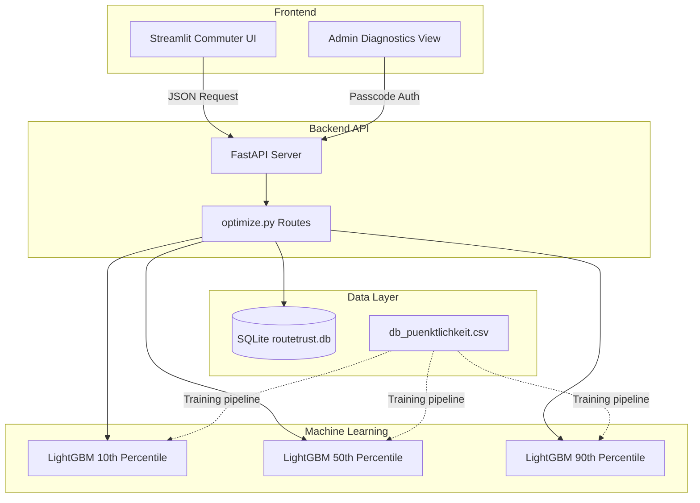

# 🚍 RouteTrust
**Chance-Constrained Reliable Transit Routing**

RouteTrust is a machine-learning-powered web application that helps commuters know *exactly* when they need to leave for the train station to arrive on time. Instead of just predicting average delays, RouteTrust uses **Quantile Regression (LightGBM)** to generate intelligent safety buffers based on your personal risk tolerance, real-world historical Deutsche Bahn punctuality data, and live weather conditions.

---

## 🌟 Key Features

* **Commuter Intelligence Interface:** A beautifully simple, jargon-free Streamlit interface. Select your route, target arrival time, local weather, and desired "Reliability Guarantee" (safety buffer).
* **Quantile Regression Models:** RouteTrust doesn't just predict the mean. It predicts the 10th, 50th, and 90th percentile delays to construct a statistical risk profile for your journey.
* **Dynamic Weather Integration:** Injects historic weather benchmarks (Clear, Cloudy, Rainy, Snowy, Stormy) directly into the LightGBM models.
* **Secure Developer Diagnostics:** A hidden "Admin Mode" provides engineers with real-time model latency, interquantile spread metrics, and detailed pipeline diagnostics.

## 🏗️ Architecture

The project is built on a modern, decoupled Python stack that cleanly separates the frontend from the predictive engine.



* **Frontend:** Streamlit (`src/ui/app.py`) for a rapid, responsive UI.
* **Backend API:** FastAPI (`src/api/main.py`) exposing the ML inference pipeline via REST endpoints.
* **Database:** SQLite (`routetrust.db`) mapping the core German railway operator segments (`db-regio`, `db-fernverkehr`) and maintaining historical transit logs.
* **Machine Learning:** LightGBM Quantile Regression models, trained on `db_puenktlichkeit.csv` to capture real-world transit delays.

---

## 🚀 Getting Started

### 1. Installation

Ensure you have Python 3.9+ installed. Clone the repository and install the dependencies in a virtual environment:

```bash
# Create and activate virtual environment
python -m venv venv
# Windows
.\venv\Scripts\Activate
# Mac/Linux
source venv/bin/activate

# Install dependencies
pip install -r requirements.txt
```

### 2. Running the Services

RouteTrust requires two services running concurrently. Open two terminal windows:

**Terminal 1: Start the FastAPI Backend**
```bash
# Ensure PYTHONPATH is set to the project root
# Windows: $env:PYTHONPATH = "."
# Mac/Linux: export PYTHONPATH="."
python -m uvicorn src.api.main:app --host 127.0.0.1 --port 8000 --reload
```

**Terminal 2: Start the Streamlit Frontend**
```bash
# Ensure PYTHONPATH is set to the project root
python -m streamlit run src/ui/app.py
```

### 3. Usage

1. Open your browser to the local Streamlit address (usually `http://localhost:8501`).
2. Use the **Commuter Form** on the left to select a route and your desired arrival time.
3. Use the **Reliability Guarantee** slider to choose how much padding you want. Higher percentages calculate a safer departure time.
4. Click **Get Departure Time** to see your RouteTrust decision card!

---

## 🔧 Developer Options (Admin Mode)

To access model metrics, latency tracking, and confidence scoring:
1. Open the Streamlit frontend.
2. At the bottom of the sidebar, expand the **🔧 Developer Options** tab.
3. Enter the administrator passcode.
4. The system will unlock a detailed diagnostics card on every prediction.

---
*Built with ❤️ for reliable public transit.*
